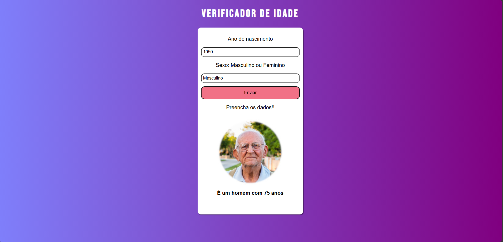

# ⏳ **Projeto Calculando Idade** 👶🧓

"Do nascimento ao presente: um simples cálculo que revela sua idade."

📖 Sobre o projeto

Este projeto foi desenvolvido no início dos meus estudos em JavaScript, com o objetivo de treinar a lógica de programação e aprofundar o uso da linguagem.

O Calculando Idade é um verificador que, a partir do ano de nascimento informado pelo usuário, determina a idade atual e exibe uma imagem correspondente à faixa etária.

🔗 [Acesse o projeto aqui](https://brenojramos.github.io/Projeto-CalculandoIdade/)

---

🛠️ Tecnologias utilizadas

HTML5 → Estrutura da página

CSS3 → Estilização e design visual

JavaScript (ES6+) → Lógica do cálculo e manipulação do DOM

---

🎯 Objetivos de aprendizagem

Praticar entrada e validação de dados do usuário

Utilizar condições e estruturas básicas do JavaScript

Manipular o DOM para alterar dinamicamente o conteúdo da página

Exercitar a criatividade com faixas etárias e imagens personalizadas

---

✨ Funcionalidades

Input para o usuário digitar seu ano de nascimento

Verificação automática da idade

Exibição de imagem correspondente à fase da vida:

  

I
